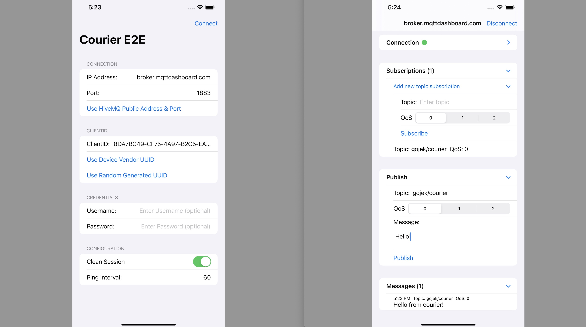

To understand the connection flow and behaviors of the library, you can play around, debug, and run the sample SwiftUI App that you can customize to connect to any broker that you want.



## Features
- Configure connection (ip, port, clientid, username, password, ping, clean session)
- Subscribe/Unsubscribe to broker and visualize current subscriptions
- Publish message to broker
- Display received messages history

## Steps
- Clone the project from [GitHub](https://github.com/gojek/courier-iOS)
- Run `pod install`
- Open `Courier.xcworkspace`
- Select `CourierE2EApp` from the scheme.

## ConnectionServiceProvider

The app provides `ConnectionServiceProvider` that conforms to `IConnectionServiceProvider` to provide connection options to Courier

```swift
class ConnectionServiceProvider: IConnectionServiceProvider {
    
    let ipAddress: String
    let port: Int
    
    let clientId: String
    let username: String?
    let password: String?
    
    let isCleanSession: Bool
    let pingInterval: Int
    
    var extraIdProvider: (() -> String?)? = nil
    
    init(ipAddress: String,
        port: Int,
        clientId: String,
        username: String? = nil,
        password: String? = nil,
        isCleanSession: Bool,
        pingInterval: Int) {
        self.ipAddress = ipAddress
        self.port = port
        self.clientId = clientId
        self.username = username
        self.password = password
        self.isCleanSession = isCleanSession
        self.pingInterval = pingInterval
    }
    
    func getConnectOptions(completion: @escaping (Result<ConnectOptions, AuthError>) -> Void) {
        completion(.success(.init(
            host: ipAddress,
            port: UInt16(port),
            keepAlive: UInt16(pingInterval),
            clientId: clientId,
            username: username ?? "",
            password: password ?? "",
            isCleanSession: isCleanSession
        )))
    }
}
```

## Courier Client Configuration in CourierObservableObject

You can peek at how the client is created and configured inside `ConnectionObservableObject` class.

```swift
init(connectionserviceProvider: ConnectionServiceProvider) {
    self.connectionServiceProvider = connectionserviceProvider
    
    // Configure & Initialize Courier
    let clientFactory = CourierClientFactory()
    self.courierClient = clientFactory.makeMQTTClient(
        config: MQTTClientConfig(
            authService: connectionserviceProvider,
            messageAdapters: [
                DataMessageAdapter(),
                JSONMessageAdapter(),
                TextMessageAdapter()
                
            ],
            autoReconnectInterval: 1,
            maxAutoReconnectInterval: 30,
            connectTimeoutPolicy: ConnectTimeoutPolicy(isEnabled: true),
            idleActivityTimeoutPolicy: IdleActivityTimeoutPolicy(isEnabled: true),
            messagePersistenceTTLSeconds: 86400,
            messageCleanupInterval: 10
        )
    )
}
```
